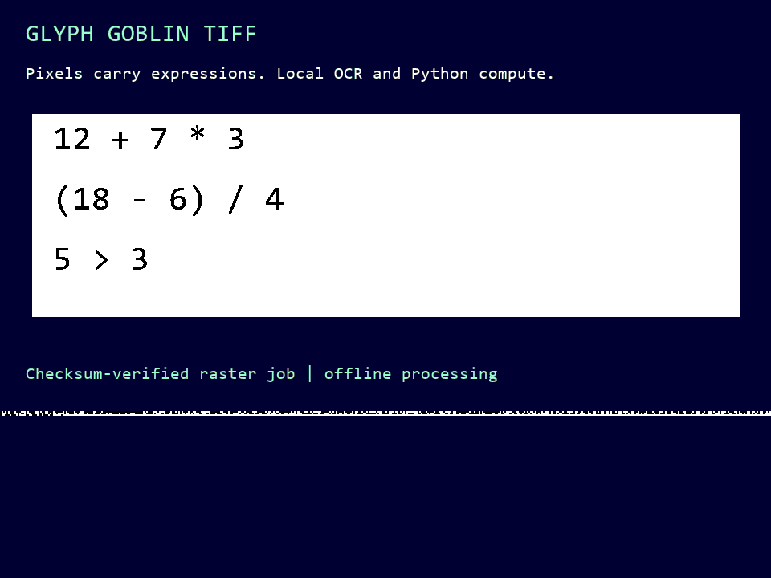

# Glyph Goblin TIFF

**Version 0.3.0** — Execute arithmetic and logic programs encoded as TIFF/GIF glyph pixels, then refresh the image with computed results.



The image contains the program: numbers, operators, parentheses, and comparisons are encoded in the visible glyph pixels. Tesseract reads those pixels; JA21 helpers plan and analyze the OCR passes; a generic bounded AST interpreter checks and executes the recovered program. The JSON raster header only selects the OCR rectangle. It does not choose the arithmetic operators or contain answers. An ordinary image viewer only displays the image. A local CPU runtime is required; there is no optical hardware or autonomous computation inside the GIF.

The checked example produces `33`, `3.0`, and `true`. Changing only operator glyphs from `12 + 7 * 3` to `12 + 7 - 3` and from `5 > 3` to `5 < 3` changes the results to `16`, `3.0`, and `false`, with the same operands and JSON header. Both TIFF and GIF inputs were executed through actual OCR. See [the operator-mutation proof](examples/program-mutation-proof.json), [the saved receipt](examples/receipt.json), and [the audit record](audit.json). Expected answers exist only in tests; the execution API receives image pixels and backend settings.


The executable-image criterion demonstrated here is **image program → pixel input → OCR and generic AST execution → computed TIFF/GIF output**. Every output frame preserves the original program glyph pixels, and the final output frame can be executed again. This establishes bounded raster-program execution, not physical optical computation or general-purpose machine equivalence.

## Install

Use Python 3.12 and install the Python dependencies:

```sh
python -m venv .venv
# Activate .venv using your shell's normal activation command.
python -m pip install -r requirements.txt
```

Install **Tesseract 5** and its **English `eng.traineddata` model** separately. The repository does not bundle an OCR executable, DLLs, language models, or a Python runtime. The [official installation guide](https://tesseract-ocr.github.io/tessdoc/Installation.html) describes Linux, macOS, and Windows options; the [official command-line guide](https://tesseract-ocr.github.io/tessdoc/Command-Line-Usage.html) documents engine usage.

Check your installation:

```sh
tesseract --version
tesseract --list-langs
```

`eng` must be available. With a standard installation on `PATH`:

```sh
python run.py run examples/input.tiff --out runs
python run.py run examples/input.gif --out runs
```

For an explicit Windows installation:

```powershell
python run.py run examples/input.tiff --tesseract "C:\Program Files\Tesseract-OCR\tesseract.exe" --tessdata-dir "C:\Program Files\Tesseract-OCR\tessdata" --out runs
```

`--tesseract` overrides `TESSERACT_CMD`; otherwise the adapter checks `PATH` and standard Windows install locations. `--tessdata-dir` overrides `TESSDATA_PREFIX`. Either model setting may name the directory containing `eng.traineddata`, or its parent if the child is named `tessdata`. If a supplied model location is invalid, the run fails instead of silently selecting another model. The child process receives an explicit model directory; global environment variables are not changed.

## Commands and outputs

```sh
# Generate fresh source carriers and run actual OCR.
python run.py demo --out runs

# Generate source carriers without requiring an OCR installation.
python run.py make-example --out runs

# Select one page/frame from a conforming carrier.
python run.py run path/to/carrier.tiff --frame 1 --out runs

python run.py --version
```

Every computation creates a new `run-*` directory. It preserves the exact source bytes, extracted OCR input pixels, prepared pass images, text and TSV output, pass evidence, and a final `receipt.json`. Successful runs also write refreshed `result.tiff` and `result.gif` carriers. Their result displays are computed from the OCR program; their instruction pixels remain unchanged and are checked after export. Failed consensus or failed output validation keeps the evidence and writes `accepted: false`; it does not publish computed values. Existing source files and earlier runs are not overwritten. `runs/` is ignored by Git.

The committed example uses fixed glyph pixels so it is portable across font installations. Newly generated examples select a local monospace font; OCR behavior may differ with the font, Tesseract build, or model. A rejected run is evidence to inspect, not a reason to relax agreement automatically.

## Acceptance and resource limits

- Three initial JA21 profiles run. Low heuristic confidence or detected table/form structure triggers the remaining three profiles; six is the limit.
- Every completed pass must agree on the parsed expression structure and expression order. Different expressions that happen to return the same answer do **not** count as agreement. Duplicate or incomplete pass identities are rejected.
- The adapter preserves raw text. Only surrounding/blank-line whitespace is ignored for parsing. It does not turn an uncertain glyph into a desired number or operator.
- Allowed expressions are bounded numbers, booleans, unary `+`, `-`, `not`, arithmetic `+ - * / %`, `and/or`, and one comparison per expression. Boolean operations produce booleans and all operands are checked. Names, calls, attributes, indexing, containers, powers, shifts, and arbitrary code are rejected.
- Limits include 200 ASCII characters and 64 syntax nodes per expression, depth 16, six expressions, and absolute intermediate/result value at most `1e12`.
- Carriers are exactly 960 × 720 pixels, at most 32 MiB and 32 frames, with a checksum-protected canonical JSON job in black/white raster cells. The job admits only the fixed arithmetic OCR rectangle. A checksum detects damage; it is not a signature or proof of authorship.
- Each OCR process has a 30-second deadline, 1 MiB limits on individual text/TSV/log files, and an 8-million-pixel prepared-image cap. Output sizes are polled every 25 ms, so a process can briefly overshoot the file-size threshold before termination. Only a trusted, locally installed Tesseract executable should be selected.

High confidence is not used to override disagreement. Even unanimous passes can repeat the same OCR mistake. The inherited confidence warning remains visible in the receipt; this project's automated acceptance rule is syntax agreement plus valid word geometry, not a calibrated guarantee of correctness. This is a research demonstration, unsuitable for consequential decisions without checking the source image.

## Test and audit

```sh
python -m unittest discover -s tests -v
```

The standard suite includes mocked OCR disagreements, equal-answer/different-expression rejection, operator-program mutation, malformed evidence, payload corruption, unsupported expression rejection, input limits, model-path selection, process timeout/log caps, source preservation, output-failure receipts, and TIFF/GIF glyph-pixel roundtrips. Two real OCR tests are opt-in; they execute both operator variants in TIFF and GIF, then execute the refreshed output images again:

```powershell
$env:TESSERACT_TEST_CMD = "C:\Program Files\Tesseract-OCR\tesseract.exe"
$env:TESSDATA_PREFIX = "C:\Program Files\Tesseract-OCR\tessdata"
python -m unittest discover -s tests -v
```

On POSIX shells, set the same variables with `export`. The release audit ran both the normal suite and actual OCR against the committed example. It does not establish the original JA21 CER/WER benchmark, searchable-PDF verification, plug-in ABI compatibility, physical hologram execution, or completion of the broader Penteract program.

## Source and license

The project is licensed under **GNU GPL version 3 only**, at the release owner's request. See [LICENSE](LICENSE) and [THIRD_PARTY_NOTICES.md](THIRD_PARTY_NOTICES.md).

Ten original JA21 0.3.2 helper modules were recovered from the supplied JA21 OCR Studio 0.4.0 standalone distribution. They are retained unchanged, with source hashes in [vendor/PROVENANCE.json](vendor/PROVENANCE.json) and the historical copyright notice preserved separately. The new runner replaces process invocation and adds explicit engine/model configuration, resource bounds, portable evidence, and fail-closed expression consensus. The source copyright belongs to Russell Philip Smithson. Tesseract, NumPy, and Pillow retain their own licenses and are installed separately.
